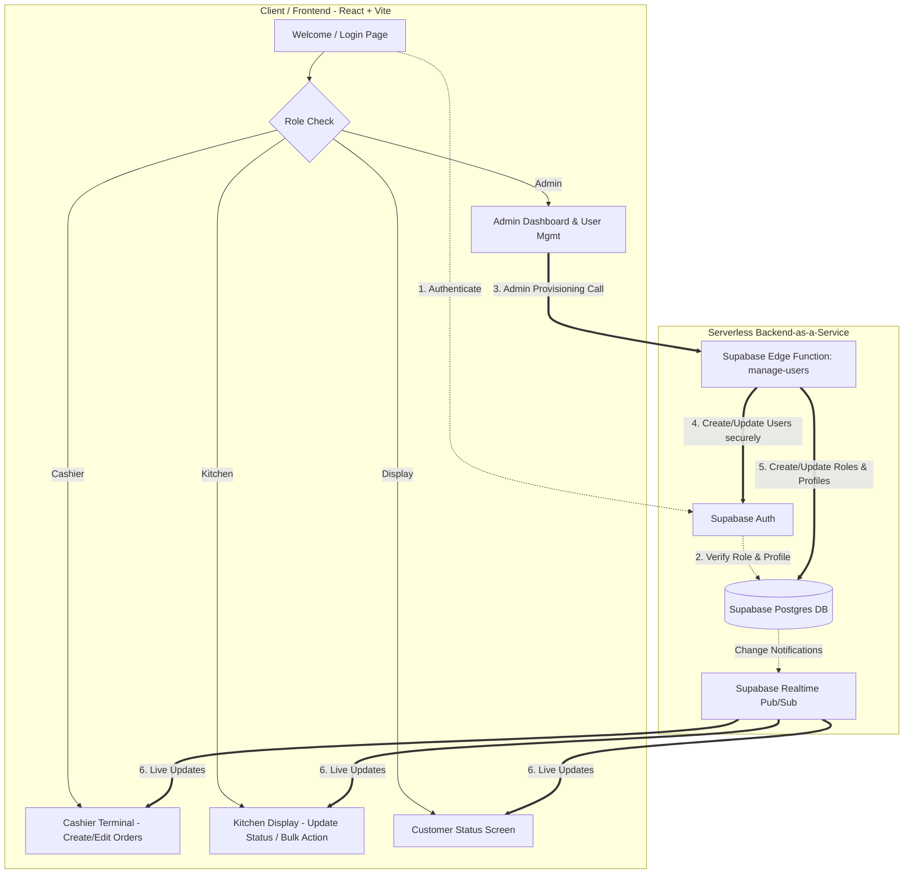

# Local Orders - Version 3

[](https://react.dev/)
[](https://vite.dev/)
[](https://supabase.com/)
[](https://deno.com/)
[](https://www.postgresql.org/)
[](https://opensource.org/licenses/MIT)

A fully serverless, production-grade **Restaurant Order Management System** designed for high-performance, real-time coordination between Admins, Cashiers, Kitchen Staff, and Customers. Built entirely on a modern serverless stack, the application does not require a traditional Express backend or VPS hosting. 

---

## 📖 Table of Contents

- [Architecture Diagram](#-architecture-diagram)
- [Main Features](#-main-features)
- [Technology Stack](#-technology-stack)
- [Folder Structure](#-folder-structure)
- [Installation Guide](#-installation-guide)
- [Environment Variables](#-environment-variables)
- [Supabase Setup](#-supabase-setup)
- [Authentication & Roles](#-authentication--roles)
- [Security Notes](#-security-notes)
- [Local Development](#-local-development)
- [Production Build](#-production-build)
- [Deployment Guide](#-deployment-guide)
- [Troubleshooting](#-troubleshooting)
- [Future Improvements](#-future-improvements)
- [License](#-license)

---

## 🏗️ Architecture Diagram



---

## ✨ Main Features

*   **Role-Based Access Control (RBAC):** Tailored experiences for Admin, Cashier, Kitchen, and Display roles.
*   **Edge Function User Provisioning:** Secure administrative user creation and password resets using a serverless Deno-based Edge Function.
*   **Order Creation Terminal:** Seamless cashier interface to create dine-in, takeaway, or delivery orders, customize items, and manage portions.
*   **Real-time Order Updates:** Orders instantly broadcast their status changes across all active client terminals.
*   **Kitchen Workflow Management:** An interactive queue displaying items grouped for cooking, supporting status updates and bulk-completion actions.
*   **Live Menu Management:** Dynamic catalog manager allowing items, pricing, categories, and availability to be updated in real time.
*   **Live Display Screen:** A public customer-facing screen displaying orders marked as "Cooking" or "Ready" in real time.
*   **Factory Reset System:** An admin-authenticated database procedure to wipe all business data and return the application to a fresh installation state.

---

## 🛠️ Technology Stack

| Component | Technology | Description |
| :--- | :--- | :--- |
| **Frontend** | React 19 + Vite 6 | Fast modern UI library built with Vite for optimal HMR. |
| **Styling** | Vanilla CSS | Fully customized responsive styles, supporting glassmorphism and modern colors. |
| **Routing** | React Router v7 | Declarative routing and route guarding based on active roles. |
| **Database** | Supabase Postgres | Relational data persistence with stored procedures and views. |
| **Realtime** | Supabase Realtime | WebSocket-driven subscriptions for live state broadcasts. |
| **Auth** | Supabase Authentication | Secure token-based user authentication. |
| **Serverless Logic** | Supabase Edge Functions | Deno runtime executing secure administrative workflows. |

---

## 📂 Folder Structure

```text
version3/
├── frontend/                       # React client application
│   ├── src/
│   │   ├── components/             # Reusable UI components
│   │   ├── lib/
│   │   │   └── supabase.js         # Supabase client instantiation
│   │   ├── pages/                  # Role-specific dashboard views
│   │   │   ├── AdminPage.jsx
│   │   │   ├── CashierPage.jsx
│   │   │   ├── DisplayPage.jsx
│   │   │   ├── KitchenPage.jsx
│   │   │   ├── MenuPage.jsx
│   │   │   ├── UserManagementPage.jsx
│   │   │   └── WelcomePage.jsx
│   │   ├── services/
│   │   │   └── api.js              # Centralized Supabase API client
│   │   ├── styles.css              # Global custom stylesheet
│   │   ├── App.jsx                 # Navigation structure & state router
│   │   └── main.jsx                # DOM attachment & entry point
│   ├── package.json
│   └── vite.config.js
├── supabase/                       # Supabase configuration & migrations
│   ├── functions/
│   │   └── manage-users/
│   │       └── index.ts            # Deno script for user provisioning
│   └── migrations/
│       └── 20260604000000_enable_realtime.sql
├── tests/                          # Integration testing suites
│   └── test-edge-function.js       # Integration test script for Edge Functions
├── .gitignore                      # Git exclusion rules
└── README.md                       # Documentation
```

---

## 📥 Installation Guide

### Prerequisites
*   [Node.js](https://nodejs.org/) (v18 or higher recommended)
*   [Supabase CLI](https://supabase.com/docs/guides/cli) (For local database migrations and function deployment)

### Steps
1.  **Clone the Repository**
    ```bash
    git clone https://github.com/your-username/local-orders.git
    cd local-orders
    ```

2.  **Install Frontend Dependencies**
    ```bash
    cd frontend
    npm install
    ```

---

## 🔑 Environment Variables

Create a `.env` file in the `frontend` root directory to link your client to the Supabase backend:

```env
# File: frontend/.env
VITE_SUPABASE_URL=your-supabase-project-url
VITE_SUPABASE_ANON_KEY=your-supabase-anon-public-key
```

---

## ⚡ Supabase Setup

To set up the database and deploy backend components, execute the following using the Supabase CLI:

### 1. Database Migration Execution
Apply the migration files locally or deploy them to your remote Supabase instance:
```bash
# Push migration files to remote Supabase instance
supabase db push
```
The migration files automatically provision essential tables (`orders`, `order_items`, `menu_items`, `profiles`) and enable the realtime system.

### 2. Realtime Configuration
Realtime must be explicitly configured for PostgreSQL tables. The migration `20260604000000_enable_realtime.sql` executes the following SQL statements to register tables with the replication publication:
```sql
ALTER PUBLICATION supabase_realtime ADD TABLE orders;
ALTER PUBLICATION supabase_realtime ADD TABLE order_items;
ALTER PUBLICATION supabase_realtime ADD TABLE menu_items;
```

### 3. Edge Function Deployment
Deploy the Deno serverless function that handles administrative user provisioning:
```bash
supabase functions deploy manage-users
```
Make sure you set the required environment secrets inside your Supabase project dashboard or via CLI:
```bash
supabase secrets set SUPABASE_SERVICE_ROLE_KEY=your-service-role-key
```

---

## 🔐 Authentication & Roles

Users are provisioned with standardized login emails based on their name: `${username}@restaurant.com`. Authentication is mapped to the following security roles:

| Role | Permitted Actions | Views |
| :--- | :--- | :--- |
| **Admin** | Manage Menu, Provision Roles, Review Dashboard Stats, Trigger System Factory Reset | `/admin`, `/user-management`, `/menu` |
| **Cashier** | Create Orders, Edit Orders, Update Delivery/Payment status, Add/Remove Items | `/cashier` |
| **Kitchen** | Monitor cooking queue, update individual/bulk item preparation statuses | `/kitchen` |
| **Display** | View active live kitchen statuses (Cooking / Ready) | `/display` |

---

## 🛡️ Security Notes

*   **No Service Role Exposure:** The highly privileged `SUPABASE_SERVICE_ROLE_KEY` is only present in the secure Deno environment of Supabase Edge Functions. It is **never** compiled or exposed inside the client-side React code.
*   **Role Validation:** The `manage-users` edge function decodes the caller's JWT token to verify that the requesting account holds the **Admin** role in the database before completing operations.
*   **Git Integrity:** System environment files (`.env`, `.env.*`) are explicitly registered in `.gitignore` to prevent secret leakage.

---

## 💻 Local Development

To run the React + Vite frontend locally in development mode:

```bash
cd frontend
npm install
npm run dev
```
The development server will spin up. Access it at `http://localhost:3000`.

---

## 📦 Production Build

To compile a production-ready optimized bundle of the frontend:

```bash
cd frontend
npm run build
```
The assets will be output to the `frontend/dist/` directory, optimized for rapid static hosting.

---

## 🚀 Deployment Guide

### Vercel
1. Install Vercel CLI or link your repository to the [Vercel Dashboard](https://vercel.com).
2. Set the build command to `npm run build` and output directory to `dist`.
3. Add the following **Environment Variables**:
   * `VITE_SUPABASE_URL`
   * `VITE_SUPABASE_ANON_KEY`

### Netlify
1. Connect your repository to [Netlify](https://netlify.com).
2. Configure build settings:
   * Build command: `npm run build`
   * Publish directory: `frontend/dist`
3. Configure the environment variables in your site settings dashboard.

### Supabase Hosting
* Deploy database components, RPC functions, and database views using the Supabase CLI.
* Deploy edge functions using `supabase functions deploy`.

---

## 🔍 Troubleshooting

### Login Failures
* **Mismatch on selected role:** Ensure the role dropdown on the login screen matches the role designated to the user profile in the database.
* **Mismatched domain:** The system automatically appends `@restaurant.com` to username inputs. Verify database profiles utilize the matching email structure.

### Missing Realtime Updates
* Verify that database replication is active. Go to the Supabase Dashboard under `Database -> Replication` and ensure the `supabase_realtime` publication has `orders`, `order_items`, and `menu_items` toggled on.
* Ensure client websocket connections are not blocked by local network proxies or firewall rules.

### Edge Function Deployment Issues
* Double-check that your Supabase CLI is authenticated using `supabase login`.
* Ensure that the `SUPABASE_SERVICE_ROLE_KEY` environment secret is set in the Supabase Dashboard under `Settings -> API -> secrets`.

---

## 📈 Future Improvements

- [ ] **Multi-Tenant Support:** Allow multiple restaurant branches to share the system while isolating tenant data.
- [ ] **Receipt Printing Integration:** Direct POS printing integrations via web Bluetooth or network thermal printers.
- [ ] **Offline-First Capabilities:** Cache local state via IndexedDB and sync automatically when internet connection resumes.
- [ ] **Advanced Analytics Dashboard:** Add visual sales trends, peak time indicators, and popular menu items graphs.

---

## 📄 License

Distributed under the MIT License. See `LICENSE` for more information.
